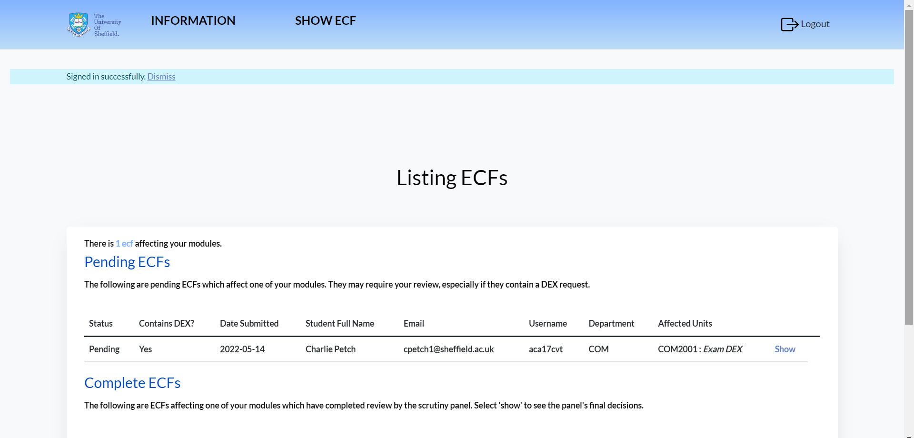

# Extenuating Circumstances Form (ECF) System

## Overview

An intuitive, web-based Extenuating Circumstances Form (ECF) management system, designed to modernize the University of Sheffield's process for handling ECF submissions. Created by Team 24, this system aims to substitute traditional paper forms and spreadsheet tracking with an efficient, user-friendly platform. 

Our ECF System is built on Ruby version 3.2.2, using the Rails framework (version 6.1.4), PostgreSQL for the database, and Hamlit for view templating. It offers a range of functionalities such as ECF creation, viewing, decision making, as well as advanced features for different user roles.

## Features

- **Students**: ECF creation, viewing, file evidence uploading, tracking of ECF status, email notifications.
- **Module Leaders**: ECF overview, module-related ECF insights, communication with the scrutiny panel.
- **Scrutiny Panel Member & Chair**: ECF management, meeting creation and attendance, decision making, user management, bulk upload, and more.

## User Roles

- **Guest** (0): Can view public information.
- **Student** (1): Full student features access.
- **Module Leader** (2): Access to module-related ECFs and related features.
- **Scrutiny Panel Member** (3): Can view and decide on ECFs.
- **Scrutiny Panel Chair/Admin** (4): Full system access, user management, meeting creation, and more.

## Quick Start Guide

1. Clone the repository and navigate into the directory.
2. Copy the sample database configuration file and set your credentials.
    ```bash
    cp config/database_sample-pg.yml config/database.yml
    ```
3. Install the required Ruby gems and Javascript dependencies.
    ```bash
    bundle install
    yarn install
    ```
4. Setup the database.
    ```bash
    rails db:setup
    ```
5. Start the server and the webpack-dev-server for live reloading.
    ```bash
    bin/webpack-dev-server
    rails s
    ```
6. Log in to the site using your University credentials. Ensure you are connected to the Sheffield VPN when running locally.
7. If needed, change your user role using the Rails console. Use `User.find({id}).update(:role => {role number})`. For instance, `User.find(1).update(:role => 4)` sets the user with id 1 as an admin.

## Running Tests

We use RSpec for our test suite. Run it with the command `rspec spec`.

## Deployment

We use the `epi-deploy` gem for deployment. 

```bash
bundle exec epi_deploy release -d demo

> Please note that this may require access to our team's GitLab repository and also being on the University's VPN.

## Tech Stack

- [Ruby 3.2.2](https://www.ruby-lang.org/en/news/2021/07/07/ruby-3-2-2-released/)
- [Rails 6.1.4](https://rubyonrails.org/)
- [PostgreSQL](https://www.postgresql.org/)
- [Hamlit](https://github.com/k0kubun/hamlit)
- [Bootstrap](https://getbootstrap.com/)
- [Webpacker](https://github.com/rails/webpacker)
- [RSpec](https://rspec.info/)

More details can be found in the [Gemfile](https://github.com/username/repository/blob/main/Gemfile).

## Contact

Please reach out to the following members for any inquiries:

- Ezra Bell: ebell3@sheffield.ac.uk
- Ariful Haque: ahaque3@sheffield.ac.uk
- Samiha Fansur: sfansur1@sheffield.ac.uk
- Jakub Bolcun: jbolcun1@sheffield.ac.uk
- Mehar Aziz: maziz3@sheffield.ac.uk
- Qinghao Du: qdu3@sheffield.ac.uk
- Euan Goodbrand: egoodbrand1@sheffield.ac.uk
- Charlie Petch: cpetch1@sheffield.ac.uk


Please replace `'BannerImageUrl'` with the actual URL of the banner image, and `'username'` and `'repository'` in the Gemfile link with your actual GitHub username and repository name.
